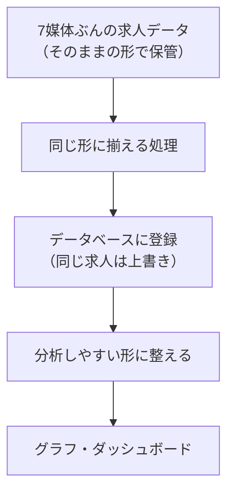

# job-posting-standardization（求人票の表記を揃えるプロジェクト）

**日本語 | [한국어](README.md)**

同じ求人が媒体ごとに違う書き方で載っている——この「表記ゆれ」を機械的に揃えて、求人市場を数字で見られるようにするプロジェクトです。データエンジニア養成ブートキャンプの課題として、第1回（テーマ・データ選び）から第4回（データを流して整える処理）まで進めています。

**ひとことで言うと**: 媒体やエージェントごとにバラバラに書かれた同じ求人を、機械が「これは同じ求人だ」と判断できる形に揃える。

> 技術者向けの詳細は各ドキュメントに置いてあります。このページは、採用やキャリア支援に関わる方が読んで分かることを優先しています。

## 1. 何を解こうとしているか

同じ会社の同じポジションでも、載せる媒体が違うと項目名も書き方も変わります。採用の現場では**表記ゆれ**と呼ばれるものです。

| 項目 | A社の媒体 | B社の媒体 | 自社サイト |
|---|---|---|---|
| 職種名の項目 | `求人タイトル` | `title` | `position_name` |
| 年収 | `年収400万〜600万円` | `4000000` | 本文の中に埋もれている |
| スキル | Python, AWS | python, aws | 文章で書かれている |

人が読めば「同じ求人ですね」で終わります。ところが機械にとっては、項目名も値の形も違う別々のデータです。この状態のまま「Pythonエンジニアの求人は何件あるか」を数えると、`Python` と `python` が別物として数えられ、市場の数字が歪みます。

このプロジェクトは、いろいろな媒体から集めた求人を同じ形に揃え、**どれとどれが同じ求人なのかを機械に判定させる**仕組みを作っています。

**なぜこのテーマか**: 自分の転職活動で、複数のエージェントを同時に使っていて実際に困ったことがきっかけです。同じ求人なのに媒体ごとに書き方が違い、比較も追跡もできませんでした。手作業で突き合わせるには件数が多すぎたので、機械にやらせようと考えました。

### 仮説の検証 — 現場に聞いて、消えた話と残った話

最初は「候補者が複数の媒体から重複して応募し、企業が手数料を二重に払ってしまう問題」も扱うつもりでした。実際に日本の大手企業の採用担当者にインタビューして確かめたところ、**この仮説は成り立ちませんでした**。正式応募の時点で媒体ごとに候補者のオーナーシップが自動的に確定し、応募前は採用担当者が候補者の個人情報を見ることすらできない仕組みだったからです。重複が起きる隙間がありませんでした。

一方で、求人票の表記ゆれの方はインタビューで裏が取れました。企業の中では職種の呼び方を一元管理していても、**エージェント・求人サイト・自社サイト・リファラルの4つの経路に出すときは、経路ごとに担当者が別々に書く**ため、そこで表記が枝分かれしていました。そこで、重複応募の話は取り下げ、確認できた表記ゆれの方にテーマを絞りました。

## 2. 使っているデータと、その選び方

### 実際の求人サイトから自動収集していない理由

求人サイトを自動収集すると、各サイトの利用規約や著作権の問題があります。また、検証に使えるデータを安定して集め続けるのも難しい。そこで、**架空の求人データを大量に自動生成し、実在の求人を少数だけ手で集めて答え合わせに使う**という形にしました。

### 2階建ての構成：実物で「型」を取り、生成データで「量」を作る

- **実物のサンプル**（`docs/golden-set/real-postings-golden-set.csv`、56行・19ケース）: 公開されている実際の求人を、6つの職種グループにまたがって手作業で書き写したものです。「同じ求人が媒体ごとにどう違って書かれるか」という**実際の型**——項目名の違い、年収の書き方、経験レベルの表記の混ざり方——をここから取り出します。
- **ただし問題があります**: このサンプルは21社（社名は伏せています）の事例にすぎません。その型をそのままコピーして増やすと、生成されたデータが「21社の焼き直し」になり、多様性が死にます。
- **どうしたか**: **「誰の求人か」と「どう書かれているか」を切り離しました**。書き方の型は実物のサンプルから取り、その型を当てはめる相手（職種名・会社・経験レベル・勤務地）はサンプルの外から幅広く組み合わせます。こうすると、日本の採用市場らしい表記の散らかり方は実物に基づいたまま、毎回違う組み合わせのデータが作れます。
- 生成の仕組み（`ingestion/`）で、実在する7つの媒体（HRMOS / doda / Geekly / OpenWork / mid_tenshoku / talentio / 自社サイト）を模した形のデータを作り、**「本当はどれとどれが同じ求人か」という答え合わせ用の正解表**（`data/synthetic/ground_truth.csv`）も別に残します。さらに、会社・職種・媒体・経験レベル・表記パターンが一方に偏っていないかを自動チェックしています。

詳しい判断の経緯は [`docs/architecture_decision_record.md`](docs/architecture_decision_record.md) のADR-005に書いています。

## 3. 全体の流れ



使っている道具と役割です。名前は覚えなくて構いません。

| 道具 | 役割 |
|---|---|
| Spark | 大量のデータをまとめて加工する |
| BigQuery | 加工済みデータを貯めておく倉庫 |
| dbt | 倉庫の中で分析用に整理する |
| Airflow | 上の処理を決まった時間に自動で動かす |
| Looker Studio | 結果をグラフで見せる |

なぜこの道具を選んだのかは [`docs/architecture_decision_record.md`](docs/architecture_decision_record.md) に、全体像の図は [`docs/diagrams/architecture-diagram-v1.html`](docs/diagrams/architecture-diagram-v1.html) にあります。

## 4. 今どこまで進んでいるか

**できていること**
- 架空の求人データを作る仕組み、実物サンプルとの照合、7媒体ぶんのデータ保管まで。経験レベルは5段階に加えて「未記載」「不明」も混ぜてあります（実際の求人でもよくあるため）。
- 求人ひとつひとつに、媒体名と媒体内IDから機械的に決まる固有の番号を振っています。同じ求人なら何度処理しても同じ番号になるので、後から重複を検出できます。

**これから**
- 揃える処理の本体、分析用の整理、自動実行の設定、データ倉庫への登録。

### 第4回の課題 — データを流して整える処理（課題提出用。本体の設計とは別）

ブートキャンプ第4回の共通課題に対応するため、保管済みデータの後ろに**データを1件ずつ流す区間**（Kafka）を薄く足しました。**この作業で本体の設計は変わっていません**。このプロジェクトはもともと、まとめて処理すれば足りる性質のデータなので、リアルタイムに流し続ける必要はありません。課題の要件を満たすための追加です。

**動かし方**
```bash
pip install -r requirements.txt
docker compose up -d                    # データを流す仕組みを起動
python streaming/producer.py            # 保管データ -> 送信
python streaming/consumer.py            # 受信 -> ファイルに保存
python streaming/spark_preprocess.py    # まとめて整える -> 結果を保存
```

**やり取りするデータの中身**: 項目の一覧と実例は [`docs/data-spec.md`](docs/data-spec.md) にあります。

**結果**（2026年8月23日、手元での実行）: 送信590件に対し受信590件で、件数は一致しました。そのあとの整える処理で590件が575件になっています。減った15件は**わざと仕込んだ「似ているけれど別の求人」**で、機械が間違えて同じ求人だと判定しないかを試すためのものです。重複は0件でした。あわせて、全角と半角が混ざった日本語の職種名を統一した項目を足しています（例：`ＳＥ` と `SE` を同じ表記に揃える）。

**実装済みと未実装**: 流す・受け取る・まとめて整える、までは実際に動かしました。同じ形に揃える処理の本体、データ倉庫への登録、分析用の整理、自動実行はこれからです。

## ドキュメント

- [`docs/architecture_decision_record.md`](docs/architecture_decision_record.md) — なぜこの道具・この方針を選んだかの記録
- [`docs/data-spec.md`](docs/data-spec.md) — データの項目定義、番号の振り方、品質チェック
- [`docs/golden-set/real-postings-golden-set.csv`](docs/golden-set/real-postings-golden-set.csv) — 実際の求人から書き写した表記ゆれのサンプル
- [`docs/diagrams/architecture-diagram-v1.html`](docs/diagrams/architecture-diagram-v1.html) — 全体像の図

## ファイル構成

```
ingestion/                    # 架空の求人データを作る
streaming/                    # 第4回課題用（本体とは別）
data/raw/                     # 7媒体ぶんの、加工前データ
data/kafka_landed/            # 流した結果を受け取ったファイル
data/processed/               # 整えたあとのデータ
data/synthetic/               # 答え合わせ用の正解表
docs/                         # 設計の記録・データ定義・サンプル・図
```
