# job-posting-standardization（求人票の表記を揃えるプロジェクト）

**日本語 | [한국어](README.md)**

同じ会社の同じポジションなのに、媒体ごとに違う書き方で載っている。人が読めば同じ求人だと分かりますが、機械にとっては別々のデータです。この**表記ゆれ**を機械的に揃えて、求人市場を数字で見られるようにするプロジェクトです。

データエンジニア養成ブートキャンプの課題として、第1回（テーマ・データ選び）から第4回（データを流して整える処理）まで進めています。

**ひとことで言うと**: 媒体やエージェントごとにバラバラに書かれた同じ求人を、機械が「これは同じ求人だ」と判断できる形に揃える。

> このページは、採用やキャリア支援に関わる方が読んで分かることを優先しています。技術的な詳細は各ドキュメントに置いてあります。

## 1. 何を解こうとしているか

### 現場では、こう起きています

採用担当者にインタビューして分かったのは、**表記ゆれは現場の不注意ではなく、体制から生まれている**ということでした。

大手企業の場合、求人はエージェント・求人サイト・自社サイト・リファラルという**4つの経路**に出ていきます。社内には職種の呼び方を揃えるルールがあり、それを処理する仕組みまで動いている。それでも表記が枝分かれするのは、**経路ごとに担当者が別々にいて、それぞれが自分の担当媒体向けに書き直すから**です。エージェントに掲載を任せる（代理掲載）ケースもあり、そこでも書き手が変わります。

つまり、社内では揃っている求人が、外に出た瞬間に4通りに割れる。しかも人事側から見ると、割れた先を突き合わせる手段がありません。

| 項目 | A媒体 | B媒体 | 自社サイト |
|---|---|---|---|
| 職種名の項目 | `求人タイトル` | `title` | `position_name` |
| 年収 | `年収400万〜600万円` | `4000000` | 本文の中に埋もれている |
| スキル | Python, AWS | python, aws | 文章で書かれている |

この状態のまま「Pythonエンジニアの求人は何件あるか」を数えると、`Python` と `python` が別物として数えられます。競合他社の採用動向を見たい、自社の提示年収が市場のどのあたりか知りたい——そういう判断の土台になる数字が、最初から歪んでいることになります。

このプロジェクトは、いろいろな媒体から集めた求人を同じ形に揃え、**どれとどれが同じ求人なのかを機械に判定させる**仕組みを作っています。

**なぜこのテーマか**: 自分の転職活動で、複数のエージェントを同時に使っていて実際に困ったのがきっかけです。同じ求人なのに媒体ごとに書き方が違い、比較も追跡もできませんでした。手作業で突き合わせるには件数が多すぎたので、機械にやらせようと考えました。

### 現場に聞いて、消えた話と残った話

思いつきで作らないために、日本の大手企業の採用担当者にインタビューして、前提を確かめました。

**消えた話**——最初は「候補者が複数の媒体から重複応募し、企業が手数料を二重に払ってしまう問題」も扱うつもりでした。しかしこの仮説は**成り立ちませんでした**。正式応募の時点で媒体ごとに候補者のオーナーシップが自動的に確定し（有効期間はおよそ6か月）、応募前は採用担当者が候補者の個人情報を見ることすらできない。つまり、名寄せが割り込む余地が構造的に存在しませんでした。「そういう事例はない」という回答でした。

**残った話**——一方で、求人票の表記ゆれの方は裏が取れました。上に書いた4経路の話がそれです。テーマをこちらに絞りました。

> インタビューで前提が崩れたのは、このプロジェクトにとってはむしろ収穫でした。作る前に確かめたので、要らないものを作らずに済んでいます。

## 2. 同じことをしている会社があります

このプロジェクトは思いつきではなく、既に事業として成立している領域を、勉強のために自分で作ってみるものです。参考にした3社を挙げます。

| | Lightcast（米・グローバル） | HRog / 株式会社フロッグ（日本） | 소문 somoon（韓国） |
|---|---|---|---|
| 解いている問題 | 出典ごとに違う職種名・スキル名を標準化し、市場データを比較可能にする | 散らばった求人サイトを統合し、業界全体の採用動向を一覧にする | 求職者には比較の基準を、機関には実際の求人に基づく市場データを提供 |
| 主な顧客 | 企業・大学・公的機関 | 人材企業、企業の採用担当、官公庁、大学、報道 | 大学、ヘッドハンター、リサーチ・コンサル |
| 規模 | 職種名 75,000件以上・スキル 34,000件以上の標準辞書 | 150媒体以上から40億件以上の求人データ | 企業の採用サイトから直接収集し、日次更新 |

（各社公式サイトで2026年8月時点の数字を確認。[Lightcast](https://lightcast.io/products/data/our-taxonomies) / [HRog](https://hrog.co.jp/services/) / [somoon](https://somoon.ai/)）

**このプロジェクトの立ち位置**: HRogが日本でやっていることの、**データを揃える部分だけ**を、日本のIT求人に対象を絞って自分で作ってみる。想定している使い手は、個人の求職者ではなく**人材企業・企業の人事・調査機関**です。

## 3. 使っているデータと、その選び方

### 実際の求人サイトから自動収集していない理由

求人サイトを自動収集すると、各サイトの利用規約や著作権の問題があります。また、検証に使えるデータを安定して集め続けるのも難しい。そこで、**架空の求人データを大量に自動生成し、実在の求人を少数だけ手で集めて答え合わせに使う**形にしました。

### 2階建て：実物で「型」を取り、生成データで「量」を作る

- **実物のサンプル**（`docs/golden-set/real-postings-golden-set.csv`、56行・19ケース）: 公開されている実際の求人を、6つの職種グループにまたがって手作業で書き写したものです。「同じ求人が媒体ごとにどう違って書かれるか」という**実際の型**——項目名の違い、年収の書き方、経験レベルの表記の混ざり方——をここから取り出します。
- **ただし問題があります**: このサンプルは21社（社名は伏せています）の事例にすぎません。その型をそのままコピーして増やすと、生成されたデータが「21社の焼き直し」になり、多様性が死にます。
- **どうしたか**: **「誰の求人か」と「どう書かれているか」を切り離しました**。書き方の型は実物のサンプルから取り、その型を当てはめる相手（職種名・会社・経験レベル・勤務地）はサンプルの外から幅広く組み合わせます。こうすると、日本の採用市場らしい表記の散らかり方は実物に基づいたまま、毎回違う組み合わせのデータが作れます。
- 生成の仕組み（`ingestion/`）で、実在する7つの媒体（HRMOS / doda / Geekly / OpenWork / mid_tenshoku / talentio / 自社サイト）を模した形のデータを作り、**「本当はどれとどれが同じ求人か」という答え合わせ用の正解表**（`data/synthetic/ground_truth.csv`）も別に残します。さらに、会社・職種・媒体・経験レベル・表記パターンが一方に偏っていないかを自動チェックしています。

判断の経緯は [`docs/architecture_decision_record.ja.md`](docs/architecture_decision_record.ja.md) のADR-005に書いています。

### 正直に書いておくと

現時点の生成データには**弱点があります**。実物のサンプルでは、同じ求人でも**職種名が94%のケースで媒体ごとに違い、年収の数字も59%で食い違う**——これが実際の表記ゆれです。ところが今の生成データは、勤務地の書き方や年収の呼び方（月給制／年俸制）は媒体ごとに変えているものの、**職種名と年収の数字は全媒体で同じ**になっています。つまり、いちばん難しいはずの部分がまだ再現できていません。

実物から型は取れているので、次はそれを生成の仕組み側に移すのが課題です。**この状態で「同じ求人を言い当てられました」と言っても、それは問題を簡単にしただけ**なので、ここは伏せずに書いておきます。

## 4. 全体の流れ

```mermaid
flowchart LR
    subgraph SRC["データのもと"]
        S1["7媒体ぶんの求人データ"]
    end

    subgraph RAW["そのままの形で保管"]
        R1["求人データ（そのまま）"]
    end

    subgraph SPARK["Spark"]
        direction TB
        SP1["表記のばらつきをそろえる"]
        SP2["同じ形に整える"]
    end

    subgraph BQ["データベース"]
        direction TB
        B1["取り込む"]
        B2["同じ求人は上書き"]
    end

    subgraph DBT["dbt"]
        direction TB
        D1["分析しやすい形に整理"]
        D2["中身のチェック"]
    end

    LOOKER["グラフ・ダッシュボード"]

    S1 --> R1 --> SP1
    SP1 --> SP2
    SP2 --> B1 --> B2
    B2 --> D1 --> D2
    D2 --> LOOKER

    AF["Airflow<br/>（決まった時間に自動で動かす）"]
    AF -.自動で動かす.-> SPARK
    AF -.自動で動かす.-> BQ
    AF -.自動で動かす.-> DBT

    classDef src fill:#eef2ff,stroke:#4f46e5,color:#312e81
    classDef raw fill:#ecfeff,stroke:#0891b2,color:#164e63
    classDef spark fill:#fff7ed,stroke:#ea580c,color:#7c2d12
    classDef bq fill:#eff6ff,stroke:#2563eb,color:#1e3a8a
    classDef dbt fill:#f0fdf4,stroke:#16a34a,color:#14532d
    classDef looker fill:#fdf4ff,stroke:#a21caf,color:#701a75
    classDef af fill:#fafafa,stroke:#6b7280,color:#374151,stroke-dasharray: 4 3

    class S1 src
    class R1 raw
    class SP1,SP2 spark
    class B1,B2 bq
    class D1,D2 dbt
    class LOOKER looker
    class AF af
```



使っている道具と役割です。名前は覚えなくて構いません。

| 道具 | 役割 |
|---|---|
| Spark | 大量のデータをまとめて加工する |
| BigQuery | 加工済みデータを貯めておく倉庫 |
| dbt | 倉庫の中で分析用に整理する |
| Airflow | 上の処理を決まった時間に自動で動かす |
| Looker Studio | 結果をグラフで見せる |

なぜこの道具かは [`docs/architecture_decision_record.ja.md`](docs/architecture_decision_record.ja.md) に、全体像の図は [`docs/diagrams/architecture-diagram-v1.html`](docs/diagrams/architecture-diagram-v1.html) にあります。

## 5. 今どこまで進んでいるか

**できていること**
- 架空の求人データを作る仕組み、実物サンプルとの照合、7媒体ぶんのデータ保管まで。経験レベルは5段階に加えて「未記載」「不明」も混ぜてあります（実際の求人でもよくあるため）。
- 求人ひとつひとつに、媒体名と媒体内IDから機械的に決まる固有の番号を振っています。同じ求人なら何度処理しても同じ番号になるので、後から重複を検出できます。

**これから**
- 職種名を標準の呼び方に寄せる処理、分析用の整理、自動実行の設定、データ倉庫への登録。

### 第4回の課題 — データを流して整える処理（課題提出用。本体の設計とは別）

ブートキャンプ第4回の共通課題に対応するため、保管済みデータの後ろに**データを1件ずつ流す区間**を薄く足しました。**この作業で本体の設計は変わっていません**。このプロジェクトはもともと、まとめて処理すれば足りる性質のデータなので、リアルタイムに流し続ける必要はありません。課題の要件を満たすための追加です。

**動かし方**
```bash
pip install -r requirements.txt
docker compose up -d                    # データを流す仕組みを起動
python streaming/producer.py            # 保管データ -> 送信
python streaming/consumer.py            # 受信 -> ファイルに保存
python streaming/spark_preprocess.py    # まとめて整える -> 結果を保存
```

**やり取りするデータの中身**: 項目の一覧と実例は [`docs/data-spec.ja.md`](docs/data-spec.ja.md) にあります。

**結果**（2026年8月23日、手元での実行）: 送信590件に対し受信590件で、件数は一致しました。そのあとの整える処理で590件が575件になっています。減った15件は**わざと仕込んだ「似ているけれど別の求人」**で、機械が間違えて同じ求人だと判定しないかを試すためのものです。重複は0件でした。あわせて、全角と半角が混ざった日本語の職種名を統一した項目を足しています（例：`ＳＥ` と `SE` を同じ表記に揃える）。

**実装済み**: 流す・受け取る・まとめて整える、までは実際に動かしました。

## ドキュメント

- [`docs/architecture_decision_record.ja.md`](docs/architecture_decision_record.ja.md) — なぜこの道具・この方針を選んだかの記録
- [`docs/data-spec.ja.md`](docs/data-spec.ja.md) — データの項目定義、番号の振り方、品質チェック
- [`docs/golden-set/real-postings-golden-set.csv`](docs/golden-set/real-postings-golden-set.csv) — 実際の求人から書き写した表記ゆれのサンプル
- [`docs/diagrams/architecture-diagram-v1.html`](docs/diagrams/architecture-diagram-v1.html) — 全体像の図

## ファイル構成

```
ingestion/                    # 架空の求人データを作る
streaming/                    # 第4回課題用（本体とは別）
data/raw/                     # 7媒体ぶんの、加工前データ
data/kafka_landed/            # 流した結果を受け取ったファイル
data/processed/               # 整えたあとのデータ
data/synthetic/               # 答え合わせ用の正解表
docs/                         # 設計の記録・データ定義・サンプル・図
```
