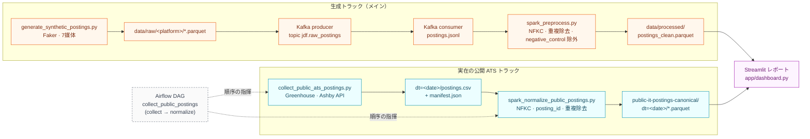

# job-posting-standardization（求人票の表記を揃えるプロジェクト）

**日本語 | [한국어](README.md)**

同じ会社の同じポジションなのに、媒体ごとに違う書き方で載っている。人が読めば同じ求人だと分かりますが、機械にとっては別々のデータです。この**表記ゆれ**を機械的に揃えて、求人市場を数字で見られるようにするプロジェクトです。

データエンジニア養成ブートキャンプの課題として、第1回（テーマ・データ選び）から第7回（結果を読む画面・最終発表）まで進めました。各回の成果物は下の「第4回〜第7回」の節を参照してください。

**ひとことで言うと**: 媒体やエージェントごとにバラバラに書かれた同じ求人を、機械が「これは同じ求人だ」と判断できる形に揃える。

> このページは、採用やキャリア支援に関わる方が読んで分かることを優先しています。技術的な詳細は各ドキュメントに置いてあります。

## 1. 何を解こうとしているか

### 現場では、こう起きています

採用担当者にインタビューして分かったのは、**表記ゆれは現場の不注意ではなく、体制から生まれている**ということでした。

大手企業の場合、求人はエージェント・求人サイト・自社サイト・リファラルという**4つの経路**に出ていきます。社内には職種の呼び方を揃えるルールがあり、それを処理する仕組みまで動いている。それでも表記が枝分かれするのは、**経路ごとに担当者が別々にいて、それぞれが自分の担当媒体向けに書き直すから**です。エージェントに掲載を任せる（代理掲載）ケースもあり、そこでも書き手が変わります。

つまり、社内では揃っている求人が、外に出た瞬間に4通りに割れる。しかも人事側から見ると、割れた先を突き合わせる手段がありません。

| 項目 | A媒体 | B媒体 | 自社サイト |
|---|---|---|---|
| 職種名の項目 | `求人タイトル` | `title` | `position_name` |
| 年収 | `年収400万〜600万円` | `4000000` | 本文の中に埋もれている |
| スキル | Python, AWS | python, aws | 文章で書かれている |

この状態のまま「Pythonエンジニアの求人は何件あるか」を数えると、`Python` と `python` が別物として数えられます。競合他社の採用動向を見たい、自社の提示年収が市場のどのあたりか知りたい——そういう判断の土台になる数字が、最初から歪んでいることになります。

このプロジェクトは、いろいろな媒体から集めた求人を同じ形に揃え、**どれとどれが同じ求人なのかを機械に判定させる**仕組みを作っています。

**なぜこのテーマか**: 自分の転職活動で、複数のエージェントを同時に使っていて実際に困ったのがきっかけです。同じ求人なのに媒体ごとに書き方が違い、比較も追跡もできませんでした。手作業で突き合わせるには件数が多すぎたので、機械にやらせようと考えました。

### 現場に聞いて、消えた話と残った話

思いつきで作らないために、日本の大手企業の採用担当者にインタビューして、前提を確かめました。

**消えた話**——最初は「候補者が複数の媒体から重複応募し、企業が手数料を二重に払ってしまう問題」も扱うつもりでした。しかしこの仮説は**成り立ちませんでした**。正式応募の時点で媒体ごとに候補者のオーナーシップが自動的に確定し（有効期間はおよそ6か月）、応募前は採用担当者が候補者の個人情報を見ることすらできない。つまり、名寄せが割り込む余地が構造的に存在しませんでした。「そういう事例はない」という回答でした。

**残った話**——一方で、求人票の表記ゆれの方は裏が取れました。上に書いた4経路の話がそれです。テーマをこちらに絞りました。

> インタビューで前提が崩れたのは、このプロジェクトにとってはむしろ収穫でした。作る前に確かめたので、要らないものを作らずに済んでいます。

## 2. 同じことをしている会社があります

このプロジェクトは思いつきではなく、既に事業として成立している領域を、勉強のために自分で作ってみるものです。参考にした3社を挙げます。

| | Lightcast（米・グローバル） | HRog / 株式会社フロッグ（日本） | 소문 somoon（韓国） |
|---|---|---|---|
| 解いている問題 | 出典ごとに違う職種名・スキル名を標準化し、市場データを比較可能にする | 散らばった求人サイトを統合し、業界全体の採用動向を一覧にする | 求職者には比較の基準を、機関には実際の求人に基づく市場データを提供 |
| 主な顧客 | 企業・大学・公的機関 | 人材企業、企業の採用担当、官公庁、大学、報道 | 大学、ヘッドハンター、リサーチ・コンサル |
| 規模 | 職種名 75,000件以上・スキル 34,000件以上の標準辞書 | 150媒体以上から40億件以上の求人データ | 企業の採用サイトから直接収集し、日次更新 |

（各社公式サイトで2026年8月時点の数字を確認。[Lightcast](https://lightcast.io/products/data/our-taxonomies) / [HRog](https://hrog.co.jp/services/) / [somoon](https://somoon.ai/)）

**このプロジェクトの立ち位置**: HRogが日本でやっていることの、**データを揃える部分だけ**を、日本のIT求人に対象を絞って自分で作ってみる。想定している使い手は、個人の求職者ではなく**人材企業・企業の人事・調査機関**です。

## 3. 使っているデータと、その選び方

### 実際の求人サイトから自動収集していない理由

求人サイトを自動収集すると、各サイトの利用規約や著作権の問題があります。また、検証に使えるデータを安定して集め続けるのも難しい。そこで、**架空の求人データを大量に自動生成し、実在の求人を少数だけ手で集めて答え合わせに使う**形にしました。

### 2階建て：実物で「型」を取り、生成データで「量」を作る

- **実物のサンプル**（`docs/golden-set/real-postings-golden-set.csv`、56行・19ケース）: 公開されている実際の求人を、6つの職種グループにまたがって手作業で書き写したものです。「同じ求人が媒体ごとにどう違って書かれるか」という**実際の型**——項目名の違い、年収の書き方、経験レベルの表記の混ざり方——をここから取り出します。
- **ただし問題があります**: このサンプルは21社（社名は伏せています）の事例にすぎません。その型をそのままコピーして増やすと、生成されたデータが「21社の焼き直し」になり、多様性が死にます。
- **どうしたか**: **「誰の求人か」と「どう書かれているか」を切り離しました**。書き方の型は実物のサンプルから取り、その型を当てはめる相手（職種名・会社・経験レベル・勤務地）はサンプルの外から幅広く組み合わせます。こうすると、日本の採用市場らしい表記の散らかり方は実物に基づいたまま、毎回違う組み合わせのデータが作れます。
- 生成の仕組み（`ingestion/`）で、実在する7つの媒体（HRMOS / doda / Geekly / OpenWork / mid_tenshoku / talentio / 自社サイト）を模した形のデータを作り、**「本当はどれとどれが同じ求人か」という答え合わせ用の正解表**（`data/synthetic/ground_truth.csv`）も別に残します。さらに、会社・職種・媒体・経験レベル・表記パターンが一方に偏っていないかを自動チェックしています。

判断の経緯は [`docs/architecture_decision_record.ja.md`](docs/architecture_decision_record.ja.md) のADR-005に書いています。

### 正直に書いておくと

現時点の生成データには**弱点があります**。実物のサンプルでは、同じ求人でも**職種名が94%のケースで媒体ごとに違い、年収の数字も59%で食い違う**——これが実際の表記ゆれです。ところが今の生成データは、勤務地の書き方や年収の呼び方（月給制／年俸制）は媒体ごとに変えているものの、**職種名と年収の数字は全媒体で同じ**になっています。つまり、いちばん難しいはずの部分がまだ再現できていません。

実物から型は取れているので、次はそれを生成の仕組み側に移すのが課題です。**この状態で「同じ求人を言い当てられました」と言っても、それは問題を簡単にしただけ**なので、ここは伏せずに書いておきます。

## 4. 全体の流れ

下は **実際にコードがあるパイプライン** です。2つのトラックは別物で、どちらも Streamlit レポートから読みます。



- **現在のスタック**: Python · Faker · Kafka（KRaft 単一ノード）· Spark（`local[*]`）· Parquet · Airflow · Streamlit
- `posting_id` = `sha256(source_platform + source_posting_id)` の決定的ハッシュ（2トラック共通、重複除去・再実行のべき等キー）
- ワンショット実行: [`scripts/run_pipeline.sh`](scripts/run_pipeline.sh) — 下の「第7回」の節

### クラウド層 — コードはある · 実クラウドは未実行

下のスクリプトはリポジトリに **あります** が、実際の GCP リソースに対して **まだ実行していません**（認証・リソース作成は手動ゲート）。そのため上の「現在の実装」図には含めていません。目標構成は [`docs/diagrams/target-architecture.html`](docs/diagrams/target-architecture.html)。

| 項目 | 状態 | 場所 |
|---|---|---|
| GCS アップロード · BigQuery staging + `MERGE ON posting_id` | コードあり · 未実行（Phase 1） | [`cloud/`](cloud/) |
| dbt Core marts（`stg_postings`, `mart_tech_demand`, `mart_platform_dist`）+ `dbt test` | コードあり · 未実行（Phase 2） | [`dbt/`](dbt/) |
| Airflow `on_failure_callback` アラート · `push_to_cloud` 分岐 | コードあり · 未実行（Phase 3） | [`dags/collect_postings_dag.py`](dags/collect_postings_dag.py) |
| Looker Studio 連携 | 計画 | サービングは現状 Streamlit + `scripts/read_result.py` + `cloud/query_marts.py`（SQL）で代替 |
| 職種 taxonomy マッピング · 給与テキストのパーサ | 計画 | Canonical Schema 全体マッピングの一部 |
| ATS トラック ↔ synth canonical のスキーマ統合 | 未検証 | 2トラックの列セットが違い `postings_canonical` 共有時に衝突しうる |

## 5. いまどこまで進んでいるか

- 架空の求人データ生成 + golden set 照合 + 媒体別 Parquet 保管（`data/raw/<platform>/`、経験レベル5段階 + null/unknown、実媒体7種）。
- Kafka ストリーミング + Spark 前処理 → `data/processed/postings_clean.parquet`（第4回）。
- ATS 収集 + Spark 正規化 + Airflow DAG（第4回）、負荷・障害・復旧の実験（第5回）、Streamlit レポート（第6回）、ワンショット実行スクリプト + サービング整理（第7回）。
- 上の「クラウド層」表の項目はコードのみ・実クラウド未実行。

### 第4回の課題 — Kafka + Spark バッチ前処理

`data/raw/<platform>/*.parquet` の後ろに Kafka ストリーミング区間を足しました。もともと合成バッチデータなのでリアルタイムは必須ではありませんが、課題要件（Kafka Producer/Consumer + Spark バッチ前処理）をこの区間で満たします。これが §4 図の「生成トラック（メイン）」です。

```bash
pip install -r requirements.txt
docker compose up -d
python streaming/producer.py            # data/raw/*/*.parquet -> Kafka topic jdf.raw_postings
python streaming/consumer.py            # topic -> data/kafka_landed/postings.jsonl
python streaming/spark_preprocess.py    # jsonl -> Spark バッチ前処理 -> data/processed/postings_clean.parquet
```

**結果**（2026年8月23日、手元での実行）: 送信590件 = 受信590件。Spark 前処理で590件 → 575件（negative_control 15件除外、posting_id 重複0件、NFKC 正規化列を追加）。

### 第4回の課題 — Airflow バッチ自動化

これまで作ったものをコード変更なしにパラメータだけ変えて再実行できるよう Airflow DAG で包みました。対象は `ingestion/collect_public_ats_postings.py`（公開 ATS API ベースの実求人収集）。`collect`（`--run-date {{ ds }}` でパーティション指定）→ `normalize`（Spark、NFKC + `posting_id` 計算 + 重複除去）。

```bash
python3 -m venv .venv-airflow && source .venv-airflow/bin/activate
pip install -r requirements-airflow.txt
export AIRFLOW_HOME="$(pwd)/airflow_home"
export AIRFLOW__CORE__DAGS_FOLDER="$(pwd)/dags"
airflow db migrate
airflow dags test collect_public_postings 2026-08-25 -c '{"companies": 5, "limit": 20}'
```

| パラメータ | 型 | 既定値 | 意味 |
|---|---|---|---|
| `companies` | int | 300 | スキャンする会社数 |
| `limit` | int（任意） | なし | 収集件数の上限 |
| `catalog_url` | string | ConorsCode/open-jobs-data | ATS ボードカタログ URL |
| `push_to_cloud` | bool | false | true のとき normalize 後に GCS→BQ→dbt（コードあり・未実行） |

**結果**（ログ全文: `docs/airflow-run-logs/`）: Run 1（`companies=5, limit=20`）収集20件 → Spark 20→20。Run 2（`companies=8`）収集1600件 → Spark 1600→1600。同じコード・別パラメータで規模が変わることを確認。

### 第5回の課題 — 負荷・障害・復旧の実験

第4回のバッチパイプラインをパラメータだけ変えて (1) 基準値 (2) 負荷増加 (3) 障害3種 (4) 復旧検証まで実施しました（全文・実行コマンド: `docs/loadtest-logs/evidence.md`）。

| 実験 | 入力 | collect | normalize |
|---|---|---|---|
| ベースライン | companies=5, limit=20 | 20件（3m26s） | 20→20（6.8s） |
| 負荷増加 | companies=300 | 25,684件（3m19s） | 25,684→25,684（8.3s） |
| 重複実行（2回連続） | 同じ run-date | 20件 / 20件 | 20→20 / 20→20（累積なし） |
| 不正入力 | 存在しない catalog-url | `HTTPError 404` で即失敗、部分ファイルなし | — |
| 強制中断 → 復旧 | Spark 途中で `timeout 3` kill | 出力0（壊れたファイルなし）→ 再実行で 25,684→25,684 に完全復旧 | — |

**確認できたこと**: 負荷が約1,284倍でも collect の実行時間はほぼ不変（カタログ全体の巡回が支配的コスト）。同じ `dt=` パーティションに再実行してもデータは累積しない（CSV `"w"` 上書き + parquet `overwrite`）。強制終了しても壊れた出力は残らず、再実行1回で完全復旧。**スコープ外**: DB 取り込み失敗の再現、Kafka トラックの障害再現。

### 第6回の課題 — 標準化レポート（Streamlit）

パイプラインが保存した結果ファイルを実際に読んで見せる画面です。読者は日本 IT 採用計画を立てる HR/TA データ分析担当。

```bash
python3 -m venv .venv-dashboard && source .venv-dashboard/bin/activate
pip install -r requirements-dashboard.txt
streamlit run app/dashboard.py                 # http://localhost:8501
```

**2つのデータセットを合算せず、最初の画面で1つを選びます。**

| データセット | ソース | 用途 |
|---|---|---|
| 日本語 標準化データセット（合成） | `data/processed/postings_clean.parquet` | 表記ゆれをどれだけ一貫して整えたかの検証 |
| グローバル公開 ATS データセット（実データ、約2万件） | `data/golden-set/public-it-postings-canonical/dt=<date>/` | 公開求人市場のスナップショット（米国・グローバル中心、日本市場ではない） |

原則 — **データが実際に示すことだけを画面で主張する**。開発者向けの列名・DB 用語は画面に出さない。チャート見出しは疑問形。未実装（職種分類、給与パース、クラウド保存、採用率・離職率などのベンチマーク）は「まだ作っていないもの」に明記。自己検証: `python app/test_dashboard.py`。

### 第7回の課題 — サービング + ワンショット実行

収集から結果確認までを **1回の実行** で再現します（生成トラック / Kafka 基準）。

```bash
# 事前: Docker Desktop / OrbStack を起動（Kafka コンテナ用）
scripts/run_pipeline.sh
# generate → Kafka producer/consumer → Spark 前処理 → data/processed/postings_clean.parquet → 読み取り
# 毎回 Kafka トピックを作り直して累積を防ぐ。SEED=42 固定 → 決定的。全出力 overwrite → 取り消し安全。
```

出力の最後に **段階別処理件数の表** が出ます:

| 段階 | 件数 |
|---|---|
| 1. 生成（`data/raw/*.parquet`） | 590 |
| 2. Kafka Producer 送信 | 590 |
| 3. Kafka Consumer 受信 | 590 |
| 4. Spark 前処理 前 | 590 |
| 5. Spark 前処理 後（最終保存） | 575 |

（前後差15 = `is_negative_control` 除外。`posting_id` 重複0。）

**サービング — 保存結果を読む場面**（どれか1つ）:
- スクリプト出力: `python scripts/read_result.py` — 最終 parquet の件数 + チャネル別件数 + スキルキーワード上位5
- ダッシュボード: `streamlit run app/dashboard.py` → http://localhost:8501
- SQL 照会（クラウド）: `python cloud/query_marts.py` — `jdf.postings_canonical` COUNT + 上位10行 + dbt マート。**コードあり · 実クラウド未実行**

**クラウド経路（コードあり、実行は手動ゲート）**:

```bash
# ユーザーが明示的に指示したときだけ — 実 GCP リソースを作る
bash cloud/setup.sh                         # API 有効化 + バケット + データセット（べき等）
scripts/run_pipeline.sh --cloud             # ローカル + GCS アップロード + BQ MERGE
cd dbt && dbt run --profiles-dir . && dbt test --profiles-dir .
python cloud/query_marts.py
```

`cloud/load_to_bq.py`: GCS parquet → `jdf.staging_postings`（WRITE_TRUNCATE）→ `MERGE INTO jdf.postings_canonical ON posting_id`。`staging_rows==0` なら raise（アラート発火）。MERGE べき等: 2回連続で `canonical_total` 不変。

**確認方法**: `scripts/run_pipeline.sh` を2回連続 → 段階別件数が同一（590→590→590→575）。`python app/test_dashboard.py` 通過。証跡キャプチャ: `docs/7th-assignment/captures/`。

## ドキュメント

- [`docs/architecture_decision_record.ja.md`](docs/architecture_decision_record.ja.md) — なぜこの道具・この方針かの記録
- [`docs/data-spec.ja.md`](docs/data-spec.ja.md) — データの項目定義、番号の振り方、品質チェック
- [`docs/golden-set/real-postings-golden-set.csv`](docs/golden-set/real-postings-golden-set.csv) — 実際の求人から書き写した表記ゆれのサンプル
- [`docs/diagrams/architecture-diagram-v1.html`](docs/diagrams/architecture-diagram-v1.html) — 現在の実装図 · [`docs/diagrams/target-architecture.html`](docs/diagrams/target-architecture.html) — クラウド込みの目標図

## ファイル構成

```
ingestion/                    # 架空の求人データを作る / 公開 ATS 収集・正規化
streaming/                    # 第4回課題用の Kafka 区間
scripts/                      # run_pipeline.sh（ワンショット）· read_result.py（サービング）
cloud/                        # GCS/BigQuery スクリプト（コードあり・未実行）
dbt/                          # dbt Core プロジェクト（コードあり・未実行）
dags/                         # Airflow DAG
app/                          # Streamlit レポート
data/raw/                     # 7媒体ぶんの加工前データ
data/processed/               # 整えたあとのデータ
data/golden-set/              # 公開 ATS 収集・正規化結果
docs/                         # 設計記録・データ定義・サンプル・図・各回の課題
```
