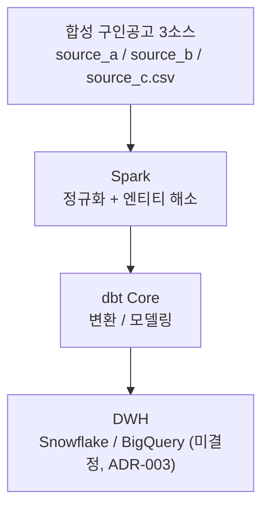

# job-posting-standardization

일본 IT 채용 시장의 구인공고(JD, Job Description)를 여러 소스에서 모으면 표기 불일치가 발생합니다. 이를 표준화하는 데이터 파이프라인 프로젝트입니다. 데이터 엔지니어 부트캠프 라이브 스터디 1차시 과제 — 프로젝트 주제·데이터셋 선정 초안입니다.

**목표 한 줄**: 여러 채용 사이트/에이전트가 서로 다르게 표기한 같은 구인공고를 정규화·엔티티 해소해 신뢰할 수 있는 시장 분석 데이터로 만든다.

## 1. 프로젝트 주제

여러 채용 사이트/에이전트가 같은 회사의 같은 포지션을 각각 다른 필드명, 다른 값 형식으로 게재합니다. 이 현상을 일본 채용 도메인에서는 **表記ゆれ(표기 흔들림)** 라고 부릅니다.

| 항목 | 사이트 A | 사이트 B | 사이트 C |
|---|---|---|---|
| 직무명 필드 | `求人タイトル`(구인 제목) | `title` | `position_name` |
| 급여 | `年収400万〜600万円`(연봉, 약 ¥4M~6M) | `4000000`(숫자) | 상세 본문에 파묻힘 |
| 기술스택 | Python, AWS | python, aws | 본문 서술형 |

사람이 보면 같은 공고지만 시스템 입장에서는 필드명·값 형식·표기 방식이 전부 달라 별개의 데이터로 취급됩니다. 이 상태로 "Python 엔지니어 수요가 몇 건인가"를 집계하면 Python/python이 각각 따로 잡혀 시장 분석 수치가 왜곡됩니다.

이 프로젝트는 여러 소스에서 들어온 구인공고를 정규화하고 같은 자리를 식별(엔티티 해소)하는 파이프라인을 구축합니다.

**왜 이 프로젝트인가**: 이직 활동 중 여러 채용 에이전트를 동시에 이용하다 직접 겪은 문제입니다. 같은 공고인데도 사이트/에이전트마다 표기가 달라 비교·추적이 어려웠습니다. 사람이 손으로 대조하기엔 이미 늦은 규모라 시스템이 대신 정리하게 만들자는 데서 이 프로젝트가 출발했습니다.

### 가설 검증 — 인터뷰로 확인한 것과 반증된 것

처음엔 "기업 측에서 지원자 중복 접수로 수수료를 이중 청구받는 문제"까지 다루려 했습니다. 실제 일본 대기업 채용담당자를 인터뷰해 검증한 결과, 이 가설은 반증됐습니다. 정식 응모 시점에 매체별로 후보자 오너십이 자동 확정되고 응모 전에는 채용담당자가 후보자 개인정보를 열람조차 할 수 없는 구조라 중복 매칭이 개입할 여지 자체가 없었습니다.

반면 구인공고 표기 흔들림 문제는 인터뷰로 오히려 확인·보강됐습니다. 기업 내부는 Taxonomy로 표기를 통합 관리하고 있었지만 에이전트·잡보드·공홈·리퍼럴 4개 채널에 공고가 나갈 때는 채널별 담당자가 각각 따로 작성해 표기가 갈라졌습니다. 그래서 이 프로젝트는 지원자 중복 접수 문제는 접고 검증된 문제인 구인공고 표기 표준화에 범위를 좁혔습니다.

## 2. 데이터셋 선정 및 이유

### 왜 실제 스크래핑을 쓰지 않았는가

구인공고 실스크래핑은 각 사이트의 이용약관(ToS)·저작권 리스크가 있고 지속적으로 안정된 학습·검증용 데이터셋을 확보하기 어렵습니다. 대신 **Faker(`ja_JP`) 기반 합성 데이터 생성 + 소규모 실제 공고 표본(golden set) 검증** 방식을 채택했습니다.

### 2단 구조: golden set(패턴) + 합성 데이터(볼륨)

- **Golden set** (`docs/golden-set/real-postings-golden-set.csv`, 28건): 실제 공개된 채용 공고를 수기로 채록한 표본입니다. "같은 공고가 사이트마다 어떻게 다르게 표기되는가"의 실제 패턴(필드명 변형, 급여 표기 방식, 시니어리티 등급 혼합 등)을 여기서 추출합니다.
- **문제점**: golden set은 회사 3곳(A사·B사·C사, 익명화)의 변주일 뿐이라 이 규칙을 그대로 복제하면 생성된 데이터가 전부 그 3개 회사의 재탕처럼 보여 다양성이 죽습니다.
- **해결**: 역할 축(직무·회사·시니어리티)과 패턴 축(golden set에서 채록한 표기 흔들림·급여 체계·티어 혼합)을 분리했습니다. 패턴 축은 golden set에서 가져오되 그 패턴이 적용되는 대상(직무명·회사·경력 등급)은 golden set 밖에서 폭넓게 뽑아 조합합니다. 이렇게 하면 표기 불일치라는 "일본 채용시장 특유의 지저분함"은 실증됐지만 매번 다른 조합으로 생성되어 볼륨 있는 데이터셋 역할을 할 수 있습니다.
- 생성기(`ingestion/generate_synthetic_postings.py`, `ingestion/synth_rules.py`)로 3개 소스 스키마(`data/synthetic/source_a.csv`, `source_b.csv`, `source_c.csv`, 정답지 `ground_truth.csv`)를 만들고 `ingestion/verify_coverage.py`로 회사/직군/표기 패턴이 한쪽에 쏠리지 않았는지 자동 검증합니다.

상세 근거는 [`docs/architecture_decision_record.md`](docs/architecture_decision_record.md)의 ADR-005(Faker 합성 데이터 vs 실제 스크래핑)를 참고하세요.

## 3. 파이프라인 개요



- **처리 엔진**: Spark (ADR-001)
- **변환 레이어**: dbt Core (ADR-002)
- **오케스트레이션**: Airflow + BashOperator (ADR-004)
- **데이터 웨어하우스**: Snowflake vs BigQuery, 아직 미결정 (ADR-003)

기술 선택의 상세 트레이드오프는 [`docs/architecture_decision_record.md`](docs/architecture_decision_record.md)에 정리되어 있습니다.

## 4. 현재 상태 / 다음 단계

- 합성 데이터 생성기, golden set 검증, GCS Raw Zone(로컬 에뮬레이션) Parquet 저장까지 완료했습니다 (`data/raw/<platform>/`, tier 5단+null/unknown 예외, 실 플랫폼 7종).
- posting_id는 `sha256(source_platform + source_posting_id)` 결정적 해시로 생성해 BigQuery MERGE 키로 그대로 씁니다.
- Spark 정규화(Canonical Schema 매핑), dbt 모델링, Airflow DAG, BigQuery 적재는 이후 세션에서 구축 예정입니다.

## 저장소 구조

```
requirements.txt              # Faker, pandas, pyarrow
ingestion/
  generate_synthetic_postings.py
  synth_rules.py
  verify_coverage.py
data/raw/                     # GCS Raw Zone 로컬 에뮬레이션 (플랫폼별 디렉토리, Parquet)
  hrmos/ doda/ geekly/ openwork/ mid_tenshoku/ talentio/ company_site/
data/synthetic/
  ground_truth.csv            # 매칭 정답지 (role_id/posting_id/tier/company 등)
docs/
  architecture_decision_record.md
  golden-set/real-postings-golden-set.csv
```
