# job-posting-standardization

**한국어 | [日本語](README.ja.md)**

일본 IT 채용 시장의 구인공고(JD, Job Description)를 여러 소스에서 모으면 표기 불일치가 발생합니다. 이를 표준화하는 데이터 파이프라인 프로젝트입니다. 데이터 엔지니어 부트캠프 라이브 스터디 과제 — 1차시(주제·데이터셋 선정)부터 4차시(Kafka+Spark 배치 전처리)까지 진행 중입니다.

**목표 한 줄**: 여러 채용 사이트/에이전트가 서로 다르게 표기한 같은 구인공고를 정규화·엔티티 해소해 신뢰할 수 있는 시장 분석 데이터로 만든다.

## 1. 프로젝트 주제

여러 채용 사이트/에이전트가 같은 회사의 같은 포지션을 각각 다른 필드명, 다른 값 형식으로 게재합니다. 이 현상을 일본 채용 도메인에서는 **表記ゆれ(표기 흔들림)** 라고 부릅니다.

| 항목 | 사이트 A | 사이트 B | 사이트 C |
|---|---|---|---|
| 직무명 필드 | `求人タイトル`(구인 제목) | `title` | `position_name` |
| 급여 | `年収400万〜600万円`(연봉, 약 ¥4M~6M) | `4000000`(숫자) | 상세 본문에 파묻힘 |
| 기술스택 | Python, AWS | python, aws | 본문 서술형 |

사람이 보면 같은 공고지만 시스템 입장에서는 필드명·값 형식·표기 방식이 전부 달라 별개의 데이터로 취급됩니다. 이 상태로 "Python 엔지니어 수요가 몇 건인가"를 집계하면 Python/python이 각각 따로 잡혀 시장 분석 수치가 왜곡됩니다.

이 프로젝트는 여러 소스에서 들어온 구인공고를 정규화하고 같은 자리를 식별(엔티티 해소)하는 파이프라인을 구축합니다.

**왜 이 프로젝트인가**: 이직 활동 중 여러 채용 에이전트를 동시에 이용하다 직접 겪은 문제입니다. 같은 공고인데도 사이트/에이전트마다 표기가 달라 비교·추적이 어려웠습니다. 사람이 손으로 대조하기엔 이미 늦은 규모라 시스템이 대신 정리하게 만들자는 데서 이 프로젝트가 출발했습니다.

### 가설 검증 — 인터뷰로 확인한 것과 반증된 것

처음엔 "기업 측에서 지원자 중복 접수로 수수료를 이중 청구받는 문제"까지 다루려 했습니다. 실제 일본 대기업 채용담당자를 인터뷰해 검증한 결과, 이 가설은 반증됐습니다. 정식 응모 시점에 매체별로 후보자 오너십이 자동 확정되고 응모 전에는 채용담당자가 후보자 개인정보를 열람조차 할 수 없는 구조라 중복 매칭이 개입할 여지 자체가 없었습니다.

반면 구인공고 표기 흔들림 문제는 인터뷰로 오히려 확인·보강됐습니다. 기업 내부는 Taxonomy로 표기를 통합 관리하고 있었지만 에이전트·잡보드·공홈·리퍼럴 4개 채널에 공고가 나갈 때는 채널별 담당자가 각각 따로 작성해 표기가 갈라졌습니다. 그래서 이 프로젝트는 지원자 중복 접수 문제는 접고 검증된 문제인 구인공고 표기 표준화에 범위를 좁혔습니다.

## 2. 데이터셋 선정 및 이유

### 왜 실제 스크래핑을 쓰지 않았는가

구인공고 실스크래핑은 각 사이트의 이용약관(ToS)·저작권 리스크가 있고 지속적으로 안정된 학습·검증용 데이터셋을 확보하기 어렵습니다. 대신 **Faker(`ja_JP`) 기반 합성 데이터 생성 + 소규모 실제 공고 표본(golden set) 검증** 방식을 채택했습니다.

### 2단 구조: golden set(패턴) + 합성 데이터(볼륨)

- **Golden set** (`docs/golden-set/real-postings-golden-set.csv`, 56행/19케이스): 실제 공개된 채용 공고를 6개 직무 그룹 전체에 걸쳐 수기로 채록한 표본입니다. "같은 공고가 사이트마다 어떻게 다르게 표기되는가"의 실제 패턴(필드명 변형, 급여 표기 방식, 시니어리티 등급 혼합 등)을 여기서 추출합니다.
- **문제점**: golden set은 회사 21곳(익명화)의 변주일 뿐이라 이 규칙을 그대로 복제하면 생성된 데이터가 그 21개 회사의 재탕처럼 보여 다양성이 죽습니다.
- **해결**: 역할 축(직무·회사·티어·근무지)과 패턴 축(golden set에서 채록한 표기 흔들림·급여 체계·티어 혼합)을 분리했습니다. 패턴 축은 golden set에서 가져오되 그 패턴이 적용되는 대상(직무명·회사·경력 등급)은 golden set 밖에서 폭넓게 뽑아 조합합니다. 이렇게 하면 표기 불일치라는 "일본 채용시장 특유의 지저분함"은 실증됐지만 매번 다른 조합으로 생성되어 볼륨 있는 데이터셋 역할을 할 수 있습니다.
- 생성기(`ingestion/generate_synthetic_postings.py`, `ingestion/synth_rules.py`)로 실 플랫폼 7종(hrmos/doda/geekly/openwork/mid_tenshoku/talentio/company_site) 스키마의 원시 데이터를 `data/raw/<platform>/*.parquet`(GCS Raw Zone 로컬 에뮬레이션)로 만들고, 정답지 `data/synthetic/ground_truth.csv`를 별도로 남깁니다. `ingestion/verify_coverage.py`로 회사/직군/플랫폼/티어/표기 패턴이 한쪽에 쏠리지 않았는지 자동 검증합니다.

상세 근거는 [`docs/architecture_decision_record.md`](docs/architecture_decision_record.md)의 ADR-005(Faker 합성 데이터 vs 실제 스크래핑)를 참고하세요.

## 3. 파이프라인 개요

```mermaid
flowchart LR
    subgraph SRC["소스"]
        S1["합성 채용공고 생성기<br/>실 플랫폼 7종(hrmos·doda·geekly 등)"]
    end

    subgraph RAW["GCS Raw Zone"]
        R1["data/raw/&lt;platform&gt;/*.parquet"]
    end

    subgraph SPARK["Spark"]
        direction TB
        SP1["일본어 정규화(NFKC)"]
        SP2["급여 표기 파싱"]
        SP3["Taxonomy 매핑 → Canonical Schema"]
    end

    subgraph BQ["BigQuery"]
        direction TB
        B1["Staging 테이블 적재"]
        B2["MERGE INTO Canonical<br/>(posting_id 키)"]
    end

    subgraph DBT["dbt Core"]
        direction TB
        D1["모델 변환(dbt run)"]
        D2["테스트(dbt test)"]
    end

    LOOKER["Looker Studio<br/>BI 대시보드"]

    S1 --> R1 --> SP1
    SP1 --> SP2 --> SP3
    SP3 --> B1 --> B2
    B2 --> D1 --> D2
    D2 --> LOOKER

    AF["Airflow<br/>(BashOperator, 순서 지휘)"]
    AF -.실행 지휘.-> SPARK
    AF -.실행 지휘.-> BQ
    AF -.실행 지휘.-> DBT

    classDef src fill:#eef2ff,stroke:#4f46e5,color:#312e81
    classDef raw fill:#ecfeff,stroke:#0891b2,color:#164e63
    classDef spark fill:#fff7ed,stroke:#ea580c,color:#7c2d12
    classDef bq fill:#eff6ff,stroke:#2563eb,color:#1e3a8a
    classDef dbt fill:#f0fdf4,stroke:#16a34a,color:#14532d
    classDef looker fill:#fdf4ff,stroke:#a21caf,color:#701a75
    classDef af fill:#fafafa,stroke:#6b7280,color:#374151,stroke-dasharray: 4 3

    class S1 src
    class R1 raw
    class SP1,SP2,SP3 spark
    class B1,B2 bq
    class D1,D2 dbt
    class LOOKER looker
    class AF af
```



- **처리 엔진**: Spark (ADR-001)
- **변환 레이어**: dbt Core (ADR-002)
- **오케스트레이션**: Airflow + BashOperator (ADR-004)
- **데이터 웨어하우스**: BigQuery (ADR-003)

기술 선택의 상세 트레이드오프는 [`docs/architecture_decision_record.md`](docs/architecture_decision_record.md)에 정리되어 있습니다.

전체 흐름을 시각화한 아키텍처 다이어그램은 [`docs/diagrams/architecture-diagram-v1.html`](docs/diagrams/architecture-diagram-v1.html)에서 확인할 수 있습니다.

## 4. 현재 상태 / 다음 단계

- 합성 데이터 생성기, golden set 검증, GCS Raw Zone(로컬 에뮬레이션) Parquet 저장까지 완료했습니다 (`data/raw/<platform>/`, tier 5단+null/unknown 예외, 실 플랫폼 7종).
- posting_id는 `sha256(source_platform + source_posting_id)` 결정적 해시로 생성해 BigQuery MERGE 키로 그대로 씁니다.
- Spark 정규화(Canonical Schema 매핑), dbt 모델링, Airflow DAG, BigQuery 적재는 이후 세션에서 구축 예정입니다.

### 4차시 과제 — Kafka + Spark 배치 전처리 (제출용, 메인 아키텍처와 별개)

라이브 스터디 4차시 공통 과제 대응용으로 `data/raw/<platform>/*.parquet` 뒤에 Kafka 구간을 얇게 추가했습니다. **JDF 메인 아키텍처(GCS→Spark Canonical 매핑→BigQuery MERGE→dbt→Airflow)는 이번 작업으로 바뀌지 않습니다** — JDF는 합성 배치 데이터라 원래 실시간 스트리밍이 필요 없는 도메인이고, 이 구간은 과제 제출 요건 충족용입니다.

**실행 명령**
```bash
pip install -r requirements.txt
docker compose up -d                    # Kafka(KRaft, 단일 노드) 기동
python streaming/producer.py            # data/raw/*/*.parquet -> Kafka topic jdf.raw_postings
python streaming/consumer.py            # topic -> data/kafka_landed/postings.jsonl
python streaming/spark_preprocess.py    # jsonl -> Spark 배치 전처리 -> data/processed/postings_clean.parquet
```

**메시지 명세**: topic `jdf.raw_postings`. 필드 정의와 메시지 예시는 [`docs/data-spec.md`](docs/data-spec.md) 참고.

**결과** (2026-08-23 로컬 실행 기준): Producer 전송 590건 = Consumer 수신 590건. Spark 전처리 전 590건 → 후 575건(negative_control 15건 제외, posting_id 중복 0건, raw_title NFKC 정규화 컬럼 추가).

**실제 구현 vs 계획**: Kafka Producer/Consumer, Spark 배치 전처리(정규화·중복제거·필터)는 실제 구현·실행 완료. Canonical Schema 전체 매핑, BigQuery MERGE, dbt 모델링, Airflow 스케줄링은 이후 세션 계획대로 미구현 상태입니다.

### 4차시 과제 — Airflow 배치 자동화 (제출용)

지금까지 만든 것을 코드 수정 없이 파라미터만 바꿔 재실행할 수 있도록 Airflow DAG로 감쌌습니다. 대상은 4차시 Kafka/Spark 트랙이 아니라 `ingestion/collect_public_ats_postings.py`(공개 ATS API 기반 실채용공고 수집기) — 이 수집기는 이미 `--companies`/`--limit`/`--catalog-url` 인자를 갖고 있어 그대로 DAG params로 노출했습니다.

**설계 결정**: 수집기가 실행할 때마다 `public-it-postings.csv`를 덮어쓰던 것을 `data/golden-set/public-it-postings/dt=<날짜>/` 파티션 구조로 바꿨습니다(`data/raw/<platform>/` 관례와 동일). `@daily`로 스케줄링하면 매번 새 파티션이 쌓여 "공고는 계속 발생한다"는 실제 패턴을 반영합니다 — 채용공고는 초 단위 이벤트가 아니라 하루~며칠 단위로 발생하므로 스트리밍이 아니라 주기적 배치 폴링이 맞는 방식이라 판단했습니다.

**실행 명령**
```bash
python3 -m venv .venv-airflow && source .venv-airflow/bin/activate
pip install -r requirements-airflow.txt
export AIRFLOW_HOME="$(pwd)/airflow_home"
export AIRFLOW__CORE__DAGS_FOLDER="$(pwd)/dags"
export AIRFLOW__CORE__LOAD_EXAMPLES=False
airflow db migrate

# 파라미터 바꿔 재실행 (코드 수정 없음)
airflow dags test collect_public_postings 2026-08-25 -c '{"companies": 5, "limit": 20}'
airflow dags test collect_public_postings 2026-08-26 -c '{"companies": 8}'
```

**DAG params**

| 파라미터 | 타입 | 기본값 | 의미 |
|---|---|---|---|
| `companies` | int | 300 | 스캔할 회사 수 |
| `limit` | int(선택) | 없음 | 수집 건수 상한 |
| `catalog_url` | string | ConorsCode/open-jobs-data | ATS 보드 카탈로그 URL |

**태스크 구성**: `collect`(ATS 수집, `--run-date {{ ds }}`로 파티션 지정) → `normalize`(Spark, NFKC 정규화 + `posting_id` 계산 + 중복 제거).

**결과** (로그 전문: `docs/airflow-run-logs/`):
- Run 1 (`companies=5, limit=20`, 2026-08-25): 수집 20건 → Spark 전/후 20건→20건
- Run 2 (`companies=8`, limit 없음, 2026-08-26): 수집 1600건 → Spark 전/후 1600건→1600건
- 같은 코드, 다른 파라미터로 결과 규모가 달라짐을 확인 — 재실행 요건 충족

**저장 위치/포맷**: `data/golden-set/public-it-postings/dt=<날짜>/postings.csv`(수집 원본), `data/golden-set/public-it-postings-canonical/dt=<날짜>/*.parquet`(정규화 결과, `posting_id` 포함)

**실제 구현 vs 계획**: DAG로 수집+정규화 자동화, 파라미터 재실행 완료. retry/재시도, 크론 스케줄 등록(현재는 수동 트리거로만 검증), BigQuery MERGE/dbt/Looker 연결은 이후 세션 범위.

## 문서

- [`docs/architecture_decision_record.md`](docs/architecture_decision_record.md) — 기술 선택 근거 (ADR-001~005)
- [`docs/data-spec.md`](docs/data-spec.md) — 데이터 레이어·스키마·ID 정책·품질 검증
- [`docs/golden-set/real-postings-golden-set.csv`](docs/golden-set/real-postings-golden-set.csv) — 실제 공고 표기 흔들림 표본
- `python ingestion/collect_public_ats_postings.py` — MIT 라이선스의 공개 ATS 회사 카탈로그에서 300개 회사를 선택하고 Greenhouse·Ashby 공식 API로 IT 공고를 수집해 `data/golden-set/public-it-postings/dt=<날짜>/postings.csv`에 저장합니다(날짜별 파티션, 4차시부터 Airflow `@daily`로 재실행). `--companies 300`으로 회사 수를 바꾸며, 개별 API 실패는 manifest에 기록하고 계속 진행합니다.
- [`docs/diagrams/architecture-diagram-v1.html`](docs/diagrams/architecture-diagram-v1.html) — 아키텍처 다이어그램

## 저장소 구조

```
requirements.txt              # Faker, pandas, pyarrow, kafka-python, pyspark
requirements-airflow.txt       # apache-airflow 등 — 4차시 전용, 별도 venv(.venv-airflow)에 설치
docker-compose.yml             # Kafka(KRaft, 단일 노드) — 4차시 과제용
dags/
  collect_postings_dag.py      # 4차시 과제용 — 수집→정규화 Airflow DAG
ingestion/
  generate_synthetic_postings.py
  synth_rules.py
  verify_coverage.py
  collect_public_ats_postings.py       # 공개 ATS API 기반 실채용공고 수집기(4차시부터 Airflow로 재실행)
  spark_normalize_public_postings.py   # 4차시 과제용 — 수집 결과 Spark 정규화
streaming/                     # 4차시 과제용 (JDF 메인 아키텍처와 별개)
  producer.py
  consumer.py
  spark_preprocess.py
data/raw/                     # GCS Raw Zone 로컬 에뮬레이션 (플랫폼별 디렉토리, Parquet)
  hrmos/ doda/ geekly/ openwork/ mid_tenshoku/ talentio/ company_site/
data/kafka_landed/
  postings.jsonl              # Kafka Consumer 적재 결과
data/processed/
  postings_clean.parquet      # Spark 배치 전처리 결과
data/golden-set/public-it-postings/dt=<날짜>/       # ATS 수집기 원본(날짜 파티션, gitignore)
data/golden-set/public-it-postings-canonical/dt=<날짜>/  # Spark 정규화 결과(gitignore)
data/synthetic/
  ground_truth.csv            # 매칭 정답지 (role_id/posting_id/tier/company 등)
docs/
  architecture_decision_record.md
  data-spec.md
  golden-set/real-postings-golden-set.csv
  plans/2026-08-25-airflow-batch-orchestration.md  # 4차시 구현 계획 + 진행 이력
  airflow-run-logs/            # 4차시 DAG 실행 로그 2건(다른 파라미터)
  diagrams/architecture-diagram-v1.html
```
